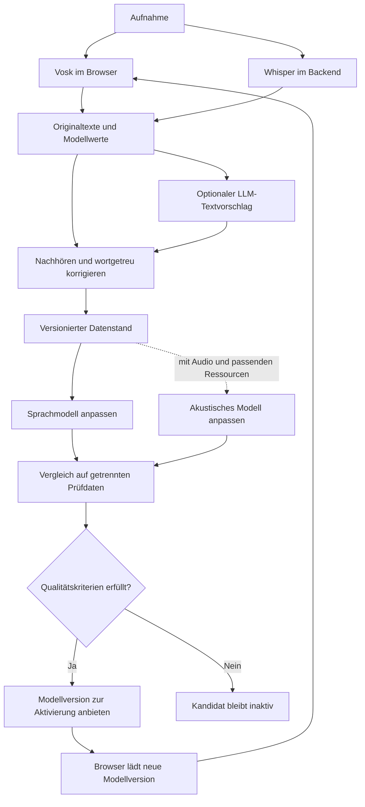

# Umsetzungsplan: Whisper-Ergebnisse zur Verbesserung von Vosk

Stand: 9. September 2026. Planungsdokument für das bestehende Projekt `little-stt`.
Die hier beschriebenen Lernfunktionen sind noch nicht implementiert.

**Ziel:** Die Anwendung sammelt auf Wunsch Audio mit überprüften Transkripten,
erzeugt daraus angepasste Vosk-Modelle und weist deren Qualität vor dem Einsatz
nach. Vosk erkennt weiterhin im Browser, Whisper läuft im Python-Backend.
Die Anwendung bleibt lokal und für eine Person überschaubar.

**Reihenfolge:** Datensammlung und Korrektur → messbare Sprachmodellanpassung →
versionierte Bereitstellung im Browser → optional akustisches Weitertraining.
Die Sprachmodellanpassung allein ist ein eigenständig nutzbares Ergebnis.

## 1. Ausgangslage und technische Grenzen

Vorhanden sind Angular 21, FastAPI, faster-whisper mit `base` auf CPU/int8,
vosk-browser mit `vosk-model-small-de-0.15`, ein optionaler Ollama-Aufruf sowie
TXT-/JSON-Export. Audio wird temporär verarbeitet. Ergebnisse und manuelle
Bearbeitungen leben bisher im Browserzustand und gehen beim Neuladen verloren.

Im tatsächlich heruntergeladenen Vosk-Archiv liegen unter anderem
`am/final.mdl`, `graph/Gr.fst`, `graph/HCLr.fst`, Konfiguration und iVector-Dateien.
Ein vollständiges Kaldi-Trainingsverzeichnis mit Rezept, Lexikon, `tree` und
weiteren benötigten Ressourcen ist darin nicht enthalten.

Vosk dokumentiert sowohl die Anpassung des Sprachmodells als auch akustisches
Finetuning. Für kleine dynamische Modelle ist ein Austausch von `Gr.fst`
vorgesehen; dieser einfache Weg erweitert den vorhandenen Wortschatz nicht.
Ob alle dafür benötigten Symbolinformationen aus unserem konkreten Paket
verwendbar sind, wird praktisch geprüft. [Offizielle Vosk-Anpassung](https://alphacephei.com/vosk/adaptation)

Neue Wörter benötigen passende Ausspracheeinträge und einen kompatiblen
Graphaufbau. Das offizielle deutsche Compile-Paket gehört zu einem anderen
Modell; es darf nicht ungeprüft mit `small-de-0.15` kombiniert werden.
[Vosk: Wörterbuch und Graphkompilierung](https://alphacephei.com/vosk/lm)

Akustisches Weitertraining des exakt vorhandenen Modells ist deshalb eine
offene technische Voraussetzung. Der Plan verspricht keine funktionierende
Trainingspipeline allein aus dem Browser-Archiv. Die Vosk-Dokumentation verweist
auf Kaldi-Beispiele; das zugehörige allgemeine Finetuning-Ticket ist weiterhin
offen. [Vosk-Ticket zum Finetuning](https://github.com/alphacep/vosk-api/issues/185)

## 2. Festgelegter Umfang

| Bereich | Entscheidung |
|---|---|
| Erste Lernsprache | Deutsch, passend zum Browser-Modell |
| Datenspeicherung | SQLite für Metadaten, Dateien für Audio und Modellpakete |
| Nutzung | Lokal, eine Person, ein Backend-Prozess und optional ein Trainingsprozess |
| Training im Browser | Keine Trainingsausführung; Browser lädt fertige Versionen |
| Erste Anpassung | Wortfolgen und Gewichtungen innerhalb des bestehenden Vokabulars |
| Akustische Anpassung | Separater Ausbau nach erfolgreicher Ressourcenprüfung |
| Trainingsauslöser | Manuell nach einer Sammlung neuer geprüfter Beispiele |
| Modellwechsel | Bewusste Aktivierung nach Vergleich, Rückkehr zur Vorversion möglich |
| LLM | Optionaler Textvorschlag, keine Quelle ungeprüfter Trainingsreferenzen |
| Infrastruktur | Kein Redis, Celery, Kubernetes, externer Datenspeicher oder MLOps-Dienst |

Bestehendes Transkribieren ohne dauerhafte Speicherung bleibt verfügbar. Der
Schalter **„Für das Lernen speichern“** legt fest, ob eine Aufnahme in die lokale
Sammlung gelangt. Eine gespeicherte Aufnahme ist noch nicht zum Training
freigegeben. Die Grenzen von 100 MB und 15 Minuten pro Upload gelten zunächst
weiter; ein Trainingsbestand besteht aus beliebig vielen solchen Aufnahmen,
begrenzt durch den konfigurierten lokalen Speicherplatz.

## 3. Ablauf für den Nutzer

1. Aufnahme auswählen und bei Bedarf „Für das Lernen speichern“ einschalten.
2. Vosk-Vorschau und Whisper-Transkript wie bisher erzeugen lassen.
3. In „Aufnahmen“ eine gespeicherte Aufnahme öffnen. Unterschiede, niedrige
   Modellwerte und mögliche fehlende Sprache helfen bei der Auswahl zu prüfender
   Stellen. Die vollständige Aufnahme bleibt abspielbar.
4. Einen Abschnitt anhören, seinen wortgetreuen Text korrigieren und
   **„Gehört und bestätigt“** wählen. Unverständliche oder überlappende Sprache
   kann für das Training ausgeschlossen werden.
5. In „Lernen“ Umfang und Verteilung des geprüften Bestands ansehen und
   **„Modellvariante erstellen“** starten.
6. Der Auftrag erstellt einen festen Datenstand, baut einen Kandidaten und
   vergleicht ihn mit Originalmodell und aktuell aktivem Modell.
7. In „Modelle“ Fehlerraten und konkrete vorher/nachher-Beispiele ansehen.
8. Bei erfüllten Kriterien **„Diese Version verwenden“** wählen. Die nächste
   Erkennung verwendet sie. Bei Problemen lässt sich die Vorversion aktivieren.

Die Trainingsfunktionen erscheinen in einem eigenen Bereich. Die normale
Transkriptionsseite erhält nur den Speicherschalter und die verwendete
Modellversion. Fachbegriffe wie `Gr.fst` oder Kaldi-Alignments bleiben in den
technischen Berichten.



## 4. Texte, Audio und Qualität der Beschriftungen

### Vier getrennte Textarten

| Feld | Zweck | Direkte Trainingsfreigabe |
|---|---|---|
| Vosk-Original | Erkennung des jeweiligen Browser-Modells, mit Wortwerten | Nein |
| Whisper-Original | Automatischer Beschriftungsvorschlag, mit Segment- und Wortwerten | Nein |
| Finaler Lesetext | Frei bearbeitete oder mit LLM geglättete Ausgabe | Nein |
| Geprüfter Wortlaut | Nachgehört, korrigiert, einem Audioabschnitt zugeordnet | Ja |

Jede Bestätigung gilt für eine bestimmte Textrevision und bestimmte
Abschnittsgrenzen. Eine anschließende Änderung setzt die Freigabe zurück.
Unverändertes Speichern eines Whisper-Texts zählt nur dann als geprüft, wenn die
Prüfung ausdrücklich bestätigt wurde. Ein LLM-Vorschlag kann in den Prüfeditor
übernommen werden, erhält aber ebenfalls zunächst den Status „ungeprüft“.

Für den Wortlaut gelten feste Regeln: gesprochene Wörter, Wiederholungen und
verständliche Füllwörter erhalten; keine Zusammenfassungen oder sprachlichen
Verbesserungen; unverständliche Bereiche aus dem akustischen Training nehmen.
Zahlen und Abkürzungen werden passend zum tatsächlich Gesprochenen erfasst.
Der Lesetext darf weiterhin „23 €“ zeigen, während der Trainingswortlaut
beispielsweise „dreiundzwanzig euro“ enthält.

### Gemeinsame Audio-Zeitachse

Für gespeicherte Lernaufnahmen erzeugt das Backend einmalig eine kanonische
WAV-Datei: Mono, 16 kHz, PCM16, erste Audiospur. Vosk, Whisper, Player und
Trainingsabschnitte verwenden für diesen Modus dieselbe Datei. Damit beziehen
sich Start und Ende zuverlässig auf dieselbe Zeitachse. Die bisherige direkte
Browser-Dekodierung bleibt im Modus ohne Speicherung bestehen.

Quelle und kanonische WAV erhalten jeweils einen SHA-256-Hash. Neben dem
Originalformat werden Decoder-Version und Normalisierungskonfiguration
gespeichert. Identische Dateien werden nicht als neue unabhängige
Trainingsbeispiele gezählt. Neu kodierte oder leicht beschnittene Kopien können
zusätzlich manuell derselben Aufnahmegruppe zugeordnet werden; Hashes allein
erkennen solche Varianten nicht zuverlässig.

Whisper liefert erste Abschnittsvorschläge. Im Editor können sie geteilt,
zusammengefügt und zeitlich korrigiert werden. Zielbereich: ungefähr 3–20
Sekunden pro Abschnitt, als anpassbare Arbeitsregel. Schnitte liegen möglichst
an Pausen; ein Satzende wird nicht allein anhand eines geschätzten Wortstempels
abgeschnitten. Nicht abgedeckte Audiobereiche bleiben sichtbar, damit VAD- oder
Whisper-Auslassungen nachgetragen werden können.

**Wortstempel von Whisper werden nach einer Textkorrektur nicht als gültige
Trainings-Alignments übernommen.** Für den ersten Sprachanpassungsschritt genügt
der Abschnittstext; für Akustiktraining werden passende Kaldi-Alignments neu
erzeugt.

### Auswahl der nächsten Prüfstellen

Ein Wortvergleich mittels Sequenzabgleich markiert Einfügungen, Löschungen und
Ersetzungen zwischen den Erkennern. Wortstempel dienen nur als zusätzliche
Zuordnungshilfe. Angezeigt werden die ursprünglichen Werte beider Systeme,
niemals deren vermeintlich gemeinsame „Wahrscheinlichkeit“.

Die erste Prüfliste priorisiert Abweichungen, niedrige Whisper-Wortwerte,
auffällige Wiederholungen, unsichere Sprache und Abschnitte mit möglicher
Nicht-Sprache. Zusätzlich enthält sie zufällig ausgewählte unauffällige
Abschnitte. So wird nicht nur an schwierigen Ausnahmefällen trainiert.
Übereinstimmende Erkenner können denselben Fehler machen.

## 5. Datenmodell und lokale Ablage

SQLite wird über die Python-Standardbibliothek angesprochen, mit
Fremdschlüsseln, kurzen Transaktionen, Schema-Version und Migrationen.
Große Binärdateien liegen außerhalb der Datenbank.

| Entität | Wesentliche Daten |
|---|---|
| `recordings` | ID, Dateiname, Quell-/PCM-Hash, interne Dateipfade, Sprache, Dauer, Aufnahmegruppe, optionale Sprecher-/Themenangabe, Speicherfreigabe, Zeitpunkte |
| `transcription_runs` | Aufnahme-ID, Engine, exakte Modellversion/Hash, Decoder-Version, Optionen, Status, unverändertes Ergebnis-JSON, Fehler |
| `segments` | Aufnahme-ID, Start/Ende, Sprecherzuordnung falls bekannt, Ausschlussgrund, aktuelle Revisions-ID |
| `transcript_revisions` | Segment-ID, Text, Herkunft, Vorgänger, Prüfstatus, Bestätigungszeitpunkt; auch Lesetext als getrennte Revision |
| `dataset_snapshots` | Unveränderliches Manifest, Revisionen, Gruppenzuordnung, Split, Normalisierer-Version, Hash, Herkunft aller Zusatztexte |
| `training_runs` | Snapshot-ID, Basismodell-ID, Anpassungsart, Parameter, Werkzeug-/Container-Versionen, Auftragsstatus, Fortschritt, Logpfad |
| `model_versions` | ID, Elternversion, Anpassungsart, Dateihashes, Paketgröße, Sprache, Browserprüfung, Trainingslauf, Lizenzangaben |
| `evaluation_runs` | Kandidat/Baseline, Referenzdatensatz, Decoder-Einstellungen, aggregierte und aufnahmeweise Ergebnisse |
| `model_selection` | Sprache → aktive Modell-ID, vorherige Version, Wechselzeitpunkt |

```text
data/
  little-stt.sqlite3
  recordings/<id>/original.<ext>
  recordings/<id>/canonical.wav
  datasets/<snapshot-id>/manifest.json
  datasets/<snapshot-id>/train.txt
  datasets/<snapshot-id>/dev.txt
  runs/<run-id>/config.json
  runs/<run-id>/build.log
  runs/<run-id>/evaluation.json
  models/<version-id>/model.tar.gz
  models/<version-id>/manifest.json
```

Ein Snapshot enthält die freigegebenen Texte und konkrete Revisionen, nicht bloß
veränderliche Zeiger. Audiodateien können über unveränderliche Hashes referenziert
werden, um sie nicht pro Lauf zu kopieren. Ein Vorabcheck stellt sicher, dass
alle referenzierten Dateien existieren und ihre Hashes passen.

`data/` kommt in `.gitignore`. Ein konfigurierbares Speicherbudget wird vor
Uploads und Trainingsläufen geprüft. Aufnahme löschen entfernt Audio, Texte und
abgeleitete temporäre Dateien; betroffene Snapshots werden als unvollständig
markiert und sind nicht erneut ausführbar. Bereits trainierte Modellgewichte
werden dadurch nicht automatisch „entlernt“. Die UI zeigt betroffene
Modellversionen und ermöglicht deren Löschung bzw. einen Neubau ohne die Daten.

Eine einfache Sicherungsfunktion exportiert eine konsistente SQLite-Sicherung,
Manifeste und referenzierte Dateien. Die Wiederherstellung wird einmal praktisch
getestet.

## 6. Backend und Auftragsausführung

Bestehende Endpunkte funktionieren während des Ausbaus weiter. Neue Endpunkte
arbeiten mit Aufnahme-IDs statt vom Client gelieferten Dateipfaden.

| API | Aufgabe |
|---|---|
| `POST /api/recordings` | Freigegebenen Upload speichern, normalisieren und Aufnahme-ID liefern |
| `GET /api/recordings` | Aufnahmeübersicht mit Sprache, Status und bestätigter Dauer |
| `GET /api/recordings/{id}` | Aufnahme, Originalergebnisse und aktuelle Textrevisionen |
| `GET /api/recordings/{id}/audio` | Kanonisches Audio für Player, Vosk und Nachhören, mit Range-Unterstützung |
| `DELETE /api/recordings/{id}` | Aufnahme samt abgeleiteten Daten entfernen, Abhängigkeiten markieren |
| `POST /api/recordings/{id}/transcriptions` | Whisper-Auftrag für gespeichertes Audio anlegen |
| `POST /api/recordings/{id}/vosk-results` | Browserergebnis mit Modell-ID, PCM-Hash und Erkennungseinstellungen speichern |
| `POST /api/recordings/{id}/segments` | Abschnitt anlegen, teilen oder zusammenfügen |
| `PATCH /api/segments/{id}` | Grenzen, Wortlaut oder Ausschluss bearbeiten; erwartet aktuelle Revisions-ID |
| `POST /api/segments/{id}/confirm` | Eine konkrete Revision als nachgehört bestätigen |
| `GET /api/learning/summary` | Datenmenge, Aufteilung, Qualitätshinweise und Trainingsbereitschaft |
| `POST /api/datasets` | Unveränderlichen Trainings-/Entwicklungsdatenstand erzeugen |
| `POST /api/training-runs` | Sprachmodell- oder später Akustikauftrag für einen Snapshot anlegen |
| `GET /api/jobs/{id}` | Status, echte Verarbeitungsschritte, Laufzeit und Fehlermeldung |
| `POST /api/jobs/{id}/cancel` | Wartenden oder laufenden Auftrag abbrechen |
| `GET /api/models` | Original und abgeleitete Versionen mit Vergleichsergebnissen |
| `GET /api/models/active?language=de` | Aktuelle Modell-ID, Paket-URL und Hash |
| `POST /api/models/{id}/activate` | Geprüfte Version atomar aktivieren; auch für Rückkehr zur Vorversion |
| `GET /api/model-files/{id}/model.tar.gz` | Unveränderliches Modellpaket ausliefern |

Änderungskonflikte geben HTTP 409 zurück, statt neuere Korrekturen zu
überschreiben. Freigabe und Export validieren Sprache, Abschnittsgrenzen,
Revisionsstatus und Dateiidentität im Backend. Clientseitige Modellwerte sind
gespeicherte Beobachtungen; sie entscheiden nicht über die Modellfreigabe.

Ein separater Python-Prozess bearbeitet eine kleine SQLite-Auftragsliste.
Die API legt Aufträge an und die UI fragt deren Status etwa alle zwei Sekunden
ab. Ein Prozess bearbeitet höchstens einen rechenintensiven Auftrag gleichzeitig.
SQLite beansprucht einen Auftrag atomar; Prozess-ID/Heartbeat erlauben die
Erkennung abgebrochener Läufe. Zustände: `queued`, `running`, `succeeded`,
`failed`, `cancelled`, `interrupted`.

Gespeicherte Whisper-Aufträge laufen über denselben Worker. Der bisherige
synchrone Whisper-Endpunkt für nicht gespeicherte Dateien verwendet eine
gemeinsame prozessübergreifende Ressourcensperre. Der heutige `threading.Lock`
allein reicht dafür nicht. Bei belegten Ressourcen zeigt die UI den wartenden
Auftrag beziehungsweise den vorhandenen Belegt-Hinweis.

Training läuft in einem Unterprozess bzw. einem optionalen lokalen Container.
Abbrechen beendet auch dessen Kindprozesse. Jeder Lauf schreibt in ein eigenes
Arbeitsverzeichnis; unvollständige Ergebnisse werden nie als Modell registriert.
Ein Neustart markiert nicht mehr laufende Aufträge als unterbrochen. Wiederholen
erzeugt einen neuen Lauf aus demselben Snapshot. Fortsetzen einzelner
Kaldi-Schritte wird erst später ergänzt, sofern zuverlässig möglich.

## 7. Sprachmodellanpassung: erster vollständiger Lernweg

### Technischer Vorversuch vor dem UI-Ausbau

Ein kleines Skript inventarisiert das Originalmodell, erzeugt Hashes und prüft
`Gr.fst`, seine Symboltabelle und die Kompatibilität von OpenFST/OpenGRM.
Eine festgeschriebene Werkzeugumgebung wird gebaut und dokumentiert.
Eine unveränderte Modellkopie muss nativ und mit vosk-browser dieselbe
Testaufnahme erfolgreich erkennen.

Danach wird ein experimenteller Sprachgraph aus wenigen bekannten Wörtern
gebaut. Er muss mit demselben `HCLr.fst`, derselben Akustik und denselben
Symbol-IDs im Browser laufen. Dieser Vorversuch prüft ausschließlich den
technischen Weg; er ist kein Nachweis besserer Erkennung.

**Abbruchbedingung:** Fehlen kompatible Symbolinformationen oder lässt sich kein
gültiger Graph bauen, werden die nötigen Originalressourcen beschafft oder
eine andere vollständig dokumentierte Modellbasis gesondert bewertet.
Datensammlung und Prüfung können trotzdem umgesetzt werden. Eine begrenzte
Runtime-Grammatik wird nicht als erfolgreiches allgemeines Weitertraining
ausgegeben.

### Wiederholbarer Trainingslauf

1. Bestätigte deutsche Abschnittsrevisionen aus dem Snapshot lesen. Entwicklungs-
   und Prüfdaten sowie ausgeschlossene Abschnitte bleiben aus dem Training heraus.
2. Mit einem versionierten Normalisierer Kleinschreibung, Satzzeichen, Zahlen und
   Abkürzungen konsistent behandeln. Originalwortlaut separat aufbewahren.
3. Wortschatzabdeckung prüfen. Unbekannte Wörter auflisten; betroffene Sätze im
   ersten Ausbau aus dem Build ausschließen, ohne Wörter stillschweigend zu löschen.
   Der Bericht nennt ausgeschlossene Wörter, Sätze und Dauer.
4. Aus dem zulässigen Text ein geglättetes n-Gramm-Sprachmodell erzeugen.
   Als kleine anfängliche Suchmenge dienen Bigramm/Trigramm und wenige
   Mischgewichte; die endgültigen Werte werden auf Entwicklungsdaten gewählt.
5. Das angepasste Sprachmodell mit einem kompatiblen allgemeinen Sprachmodell
   mischen, um allgemeine Sprache zu erhalten. Vorher nachweisen, dass die
   Originalrepräsentation hierfür geeignet ist, oder ein kompatibles allgemeines
   Modell beschaffen. Keine willkürliche Vereinigung von FST-Dateien.
6. Graph begrenzen, kompilieren und auf gültige Symbole, Gewichte und Ladefähigkeit
   prüfen. Sämtliche übrigen Modellkomponenten bleiben für diesen Anpassungstyp
   bitidentisch zur Basisversion.
7. Native Vergleichserkennung, Browserprüfung und Qualitätsbewertung durchführen.
8. Nur vollständige Kandidaten als neue unveränderliche Modellversion registrieren.

Die Mischung und ihre Gewichte sind Projektentscheidungen, keine bereits
vorhandene Funktion. OpenGRM/Kaldi werden nur in der optionalen Trainingsumgebung
benötigt. Die normale Anwendung benötigt sie nicht.

Falls eine sinnvolle Mischung technisch noch nicht gelingt, darf ein rein auf
Domänentext aufgebauter Graph als expliziter Versuch bewertet werden. Die
allgemeinen Qualitätskriterien gelten trotzdem; ohne Nachweis einer brauchbaren
Erkennung wird er nicht zur regulären Aktivierung angeboten.

## 8. Automatische Whisper-Beschriftungen als späterer Ausbau

Zunächst trainieren nur nachgehörte Texte. Danach kann eine zweite Datenklasse
`pseudo_labeled` hinzukommen, deren Referenzen direkt von Whisper stammen.
Diese wird dauerhaft von `human_verified` unterschieden und erhält nie allein
wegen eines Modellwerts den Status „geprüft“.

Voraussetzung ist eine Messung, dass das gewählte Whisper-Modell im tatsächlichen
Anwendungsgebiet ausreichend gute Vorschläge liefert. Das bestehende `base`
wird dafür als Ausgangspunkt gemessen; ein größeres Teacher-Modell ist eine
separat bewertete Option mit mehr Rechenbedarf.

Ein zunächst deaktivierter Filter kann Sprachentscheidung, Wortwertverteilung,
Nicht-Sprache-Indikatoren, Wiederholungen, Längenverhältnisse und Abweichungen zu
Vosk auswerten. Grenzwerte werden anhand manuell geprüfter Entwicklungsdaten
eingestellt. Es gibt keinen universellen Grenzwert „ab 0,9 ist der Text richtig“.

Verglichen werden zwei Varianten auf denselben unabhängigen Referenzen:
nur geprüfte Daten versus geprüfte Daten plus automatisch beschriftete Daten.
Der Anteil automatischer Beschriftungen wird zunächst begrenzt; mögliche
Gewichtung muss das jeweilige Trainingsrezept tatsächlich unterstützen.
Eine Stichprobe automatisch angenommener Beispiele wird weiterhin nachgehört.
Die Erweiterung wird nur genutzt, wenn sie einen nachgewiesenen Zusatznutzen
bringt. Prüftexte und ihre Audioaufnahmen werden auch nicht als unbeschriftete
Teacher-Daten in einen Trainingslauf übernommen.

## 9. Akustisches Weitertraining: bedingter zweiter Lernweg

### Voraussetzungen prüfen

Für das konkrete Ausgangsmodell werden Architektur, Feature-Konfiguration,
iVector-Verwendung, Phoneminventar, Lexikon, Kontextbaum und passendes
Trainingsrezept ermittelt. Benötigte zusätzliche Trainingsartefakte hängen
davon ab, ob beispielsweise ein Chain- oder ein anderes Kaldi-Rezept verwendet
wird. Ein veröffentlichtes Beispiel für ein anderes Modell ist keine direkt
einsetzbare Konfiguration.

Das von Vosk verlinkte Kaldi-Beispiel zeigt einen modellabhängigen Ablauf mit
Feature-Erzeugung, Alignment und Übernahme vorhandener Gewichte. Es dient als
technische Referenz für den Vorversuch, nicht als zugesicherter Trainingsbefehl
für `small-de-0.15`. [Kaldi-Finetuning-Beispiel](https://github.com/kaldi-asr/kaldi/blob/master/egs/aishell2/s5/local/nnet3/tuning/finetune_tdnn_1a.sh)

Sind die benötigten Ressourcen nicht verfügbar, bleibt dieser Lernweg gesperrt
und nennt die konkret fehlenden Dateien bzw. Rezepte. Alternativ kann eine
trainierbare deutsche Vosk/Kaldi-Basis geprüft werden. Diese muss anschließend
dieselben Browser- und Ressourcenanforderungen erfüllen; sie wäre ein eigener
Modellwechsel mit vollständigem Vergleich.

### Daten und Training

1. Nur eindeutig zugeordnete Audioabschnitte mit passenden Textrevisionen
   exportieren; Sprecherwechsel und überlappende Sprache zunächst ausschließen.
2. Kaldi-Datenverzeichnisse mit `wav.scp`, `text`, `utt2spk`, `spk2utt` und bei
   Verweisen auf längere Aufnahmen `segments` erzeugen. IDs und Dateien werden
   konsistent sortiert und mit den Kaldi-Prüfwerkzeugen validiert.
   Sprecherzuordnungen werden dokumentiert; unbekannte Sprecher erhalten keine
   fiktive gemeinsame globale Identität. [Kaldi-Datenformat](https://kaldi-asr.org/doc/data_prep.html)
3. Features, Normalisierung und iVectors passend zur Modellbasis erzeugen.
   Wort-/Phonem-Alignments neu berechnen, fehlgeschlagene Zuordnungen ausweisen.
4. Ein kurzes probeweises Training ausführen. Erst bei gültigem Checkpoint,
   plausiblen Verlustwerten und funktionierender Erkennung einen ganzen Lauf starten.
5. Mit konservativer Lernrate und begrenzter Epochensuche arbeiten; Parameter
   aus dem kompatiblen Rezept ableiten und auf Entwicklungsdaten abstimmen.
   Frühes Stoppen und geeignete allgemeine Trainingsdaten sollen eine zu starke
   Spezialisierung begrenzen, sofern solche Daten verfügbar sind.
6. Zunächst nur die Akustik ändern und mit festem Sprachmodell vergleichen.
   Anschließend kann eine zusätzliche Kombination mit angepasstem Sprachmodell
   bewertet werden. Beide Änderungstypen bleiben im Manifest nachvollziehbar.
7. Ein browserfähiges Paket erzeugen und durch denselben Freigabeprozess führen.

Rechenzeit, RAM- und GPU-Bedarf werden im Vorversuch gemessen. Für diesen Schritt
gibt es vor der Wahl des Rezepts keine belastbare Hardware- oder Laufzeitzusage.
Ein GPU-fähiger Linux-Trainingsrechner kann sinnvoll werden; die eigentliche
Transkriptions-App bleibt davon unabhängig.

## 10. Datenaufteilung und belastbarer Qualitätsvergleich

### Aufnahmegruppen statt zufälliger Audiostücke

Vor jedem Modellversuch werden Aufnahmen in Training, Entwicklung und Prüfung
eingeteilt. Startvorschlag: ungefähr 70/15/15 nach Dauer, **gruppenweise nach
Originalaufnahme und Aufnahmesitzung**. Die Prozentwerte sind anpassbar, die
Gruppentrennung ist verbindlich. Ausschnitte und Kopien derselben Quelle gehören
in dieselbe Gruppe. Eine einzelne OGG-Datei reicht für einen Techniktest, nicht
für eine Aussage über unabhängige Verbesserung.

Beim Ziel „meine Stimme“ dürfen dieselben Sprecher in verschiedenen Gruppen
vorkommen, ihre Sitzungen müssen getrennt sein. Beim Ziel „neue Sprecher“ muss
zusätzlich sprecherweise getrennt werden. Der Evaluationsbericht nennt das
tatsächlich gemessene Ziel.

Zum Prüfbestand gehören repräsentative Zielaufnahmen und eine kleine getrennte
Auswahl allgemeiner Sprache. Referenztexte werden vollständig gegen das Audio
geprüft, auch an Stellen, die beide Systeme übersprungen haben. Übereinstimmung
mit Whisper allein ist keine Qualitätsmetrik.

Trainings- und Filterparameter werden ausschließlich anhand der
Entwicklungsdaten gewählt. Die Prüfung dient der Freigabe eines zuvor
ausgewählten Kandidaten. Werden Prüfbeispiele später gezielt zum Optimieren
genutzt, werden sie Entwicklungsdaten; für die nächste belastbare Freigabe
braucht es neue unbenutzte Prüfaufnahmen. Datensatzversionen halten dies fest.

### Messwerte

- Wortfehlerrate: `WER = (Ersetzungen + Löschungen + Einfügungen) / Referenzwörter`.
  Aggregation über die gesamten Wortzahlen, zusätzlich Ergebnisse pro Aufnahme.
- Zeichenfehlerrate als Zusatzinformation, insbesondere bei Schreibvarianten.
- Einfügungen auf Stille-/Geräuschaufnahmen separat zählen; dort gibt es keinen
  sinnvollen WER-Nenner von Referenzwörtern.
- Fehler bei ausgewählten Namen, Zahlen und Fachbegriffen separat ausweisen.
- Laufzeit pro Audiominute, Zeit bis zum ersten Ergebnis, Modellgröße sowie
  Ladezeit im Browser mit und ohne Cache.
- Speicherverbrauch soweit zuverlässig messbar; Browser-Ladefehler, Abstürze
  und Abschluss des letzten Textstücks auf den festgelegten Zielgeräten.

Alle Varianten verwenden dieselben Audiodaten, Normalisierungsregeln und
vergleichbaren Decoder-Einstellungen. Der Referenznormalisierer wird unabhängig
vom Vokabular des Kandidaten festgelegt: Unbekannte Referenzwörter dürfen bei
der Bewertung nicht entfernt werden.

### Vorgeschlagene Freigaberegeln

Die folgenden Werte sind **Projektstartwerte**, keine allgemeinen
wissenschaftlichen Garantien. Sie werden vor dem ersten Vergleich festgelegt
und im Bericht zusammen mit ihrer Version gespeichert:

| Kriterium | Vorgeschlagene Bedingung |
|---|---|
| Zielaufnahmen | Mindestens 5 % relative WER-Verbesserung gegenüber der aktiven Version; Originalmodell zusätzlich ausweisen |
| Allgemeine Sprache | Höchstens 1 Prozentpunkt absolute WER-Verschlechterung |
| Mindestbasis für Empfehlung | Zunächst mindestens 10 unabhängige Prüfgruppen und 1.000 Referenzwörter; darunter nur „experimentell“ |
| Technische Funktion | Keine Lade-/Erkennungsfehler in nativer und Browserprüfung |
| Geschwindigkeit | Auf festgelegtem Gerät höchstens 20 % langsamer als die aktive Version |
| Paketgröße | Für reine Sprachmodellanpassung zunächst höchstens das 1,5-Fache der Basisversion |
| Integrität | Gültige Hashes, vollständiges Manifest, keine Überschneidung von Trainings- und Prüfdaten |

Beispiel: 20 % WER auf 19 % WER ist eine relative Verbesserung von 5 % und eine
absolute Verbesserung von einem Prozentpunkt. Bei bereits sehr niedriger WER
oder zu wenigen Fehlern reicht eine solche Prozentgrenze allein nicht aus.

Zusätzlich wird die Unsicherheit durch gepaartes Resampling ganzer
Aufnahmegruppen ausgewertet, mit festem Seed, 2.000 Wiederholungen und einem
95-%-Intervall für die WER-Differenz. Für eine reguläre Empfehlung muss dieses
Intervall auf eine Verbesserung hindeuten und darf null nicht einschließen.
Die Mindestbasis ist eine praktische Untergrenze, kein Beleg statistischer
Zuverlässigkeit für jede Datenverteilung. Sind zu wenige
unabhängige Gruppen vorhanden oder ist der Unterschied unklar, lautet das
Ergebnis „mehr Prüfdaten erforderlich“. Ein eigener experimenteller Testlauf
bleibt möglich, das Standardmodell bleibt aktiv.

## 11. Versionierung, Browser-Cache und Rückkehr

Das unveränderte Original wird als erste feste Version registriert. Jede neue
Version erhält einen eigenen Paketpfad, etwa
`/api/model-files/de-lm-0002/model.tar.gz`. Zusätzlich enthält das Manifest die
SHA-256-Hashes von Paket und Komponenten, Elternversion, Trainingsdatenstand,
Parameter, Werkzeuge, Normalisierung und Evaluation.

Die bisher fest eingetragene URL `/models/vosk-de.tar.gz` in `frontend/src/vosk.ts`
wird durch das Ergebnis des Active-Model-Endpunkts ersetzt. Ein Modellpaket
wird niemals unter derselben Versions-URL überschrieben. Das berücksichtigt,
dass vosk-browser geladene Modelle URL-bezogen im Browser speichert.
Das Verhalten ist im [Worker von vosk-browser](https://github.com/ccoreilly/vosk-browser/blob/master/lib/src/worker.ts)
nachzuvollziehen und wird zusätzlich praktisch getestet.

Die aktive Auswahl wird in einer SQLite-Transaktion gewechselt. Ein laufender
Recognizer bleibt bei seiner gestarteten Version und speichert genau deren ID.
Neue Erkennungen holen die aktive Auswahl mit deaktiviertem HTTP-Cache.
Das eigentliche versionierte Archiv darf langfristig gecacht werden.

Bei einem Ladefehler versucht die Anwendung einmal die letzte bekannte
funktionierende Version und zeigt die tatsächlich verwendete Version an.
Ein Rollback ist dieselbe atomare Aktivierung einer älteren Version, ohne
Neutraining. Referenzierte bzw. aktive Modelle werden nicht durch automatische
Dateibereinigung entfernt. Die Originalversion bleibt als Rückfallebene erhalten.

Neue Modellpakete liefert FastAPI direkt aus `data/models/`. So erfordert ein
Trainingslauf keinen Angular-Neubuild. Diese Routen werden vor dem allgemeinen
Frontend-Mount registriert; der Entwicklungsproxy deckt sie über `/api` ab.

## 12. Geplante Änderungen im Repository

Dateinamen sind Zielstruktur; es werden nur Module angelegt, die tatsächlich
benötigte Verantwortung übernehmen.

```text
backend/
  main.py                 API, Registrierung der Module, statische Auslieferung
  audio.py                einheitliche Dekodierung, Normalisierung, Zeitachse
  storage.py              SQLite, Revisionen, Metadaten, Migrationen
  recordings.py           Aufnahme- und Prüf-Endpunkte
  learning.py             Datensätze, Aufträge, Modellverwaltung
training/
  worker.py               persistente Auftragsausführung und Abbruch
  dataset.py              Snapshot, Split, Normalisierung, Export
  adapt_lm.py             Sprachmodellaufbau in festgelegter Werkzeugumgebung
  evaluate.py             native Erkennung, WER/CER, Berichte
  package_model.py        Manifest, Hashes, browserfähiges Archiv
  acoustic.py             erst nach erfolgreicher Machbarkeitsprüfung
frontend/src/
  app.ts / app.html       vorhandene Transkriptionsseite und Navigation
  vosk.ts                 Audio-/Modell-URL als Parameter, Version beim Ergebnis
  recordings.*            Sammlung und wortgetreue Abschnittskorrektur
  learning.*              Datenumfang, Auftragsstatus und Ergebnisvergleich
  models.*                aktive Version und Rückkehr
scripts/
  inspect_vosk_model.py   technische Vorprüfung
  download_vosk.py        Originalmodell installieren und registrieren
tests/
  test_storage.py
  test_datasets.py
  test_learning_api.py
  test_evaluation.py
docs/
  LERNPLAN.md
```

Ein optionales Trainings-Containerrezept fixiert überprüfte Versionen von
Kaldi/OpenFST/OpenGRM. Akustiktraining kann später eine eigene GPU-Variante
erhalten. Das Containerrezept startet keine Zusatzdienste und wird nicht beim
normalen App-Start gebaut.

## 13. Arbeitspakete mit Abhängigkeiten und Abnahme

Aufwandsschätzungen gelten für eine entwickelnde Person, vorhandene lokale
Umgebung und kleine Datenmengen. Sie sind Planungswerte; Datensammlung,
Nachhören, Downloads und Trainingslaufzeiten kommen hinzu.

| Paket | Inhalt | Abhängigkeit | Abnahme | Grober Aufwand |
|---|---|---|---|---|
| P0 | Modell-/Werkzeugprüfung, erste deutsche Referenzaufnahmen, Baseline | Keine | Unverändertes Modell und experimenteller Graph nativ/im Browser geprüft; fehlende Ressourcen benannt | 1–3 Tage |
| P1 | SQLite, Aufnahmeablage, kanonisches Audio, Originalergebnisse | Keine; P0 liefert Modellidentität | Aufnahme überlebt Neustart; Quelle, Zeitachse und Modellversionen nachvollziehbar | 1–2 Tage |
| P2 | Abschnittseditor, Abweichungen, Bestätigung, Ausschluss | P1 | Nutzer hört Abschnitt, korrigiert ihn und exportiert eindeutig freigegebenen Wortlaut | 2–3 Tage |
| P3 | Datensnapshots, Gruppenaufteilung, Normalisierung, Datenbericht | P2 | Gleiche Inputs erzeugen gleichen Dateninhalt/Hash; keine Überschneidungen | 1–2 Tage |
| P4 | Auftragsprozess und Sprachmodelltraining | P0 erfolgreich, P3 | Reproduzierbarer Kandidat; Abbruch und Fehler beschädigen keine aktive Version | 2–4 Tage |
| P5 | Evaluation und verständlicher Vergleichsbericht | P3, für Kandidaten P4 | Original, aktive Version und Kandidat werden gegen geprüfte Referenzen bewertet | 1–2 Tage |
| P6 | Modellregister, Browserwechsel und Rollback | P4, P5 | Neue Version ohne Frontend-Build nutzbar; Rückkehr einschließlich Browser-Cache geprüft | 1–2 Tage |
| P7 | Gesamttests, Wiederherstellung, Doku und Bedienungsabschluss | P1–P6 | Vollständige Lernrunde mit deutscher Aufnahme von Upload bis Modellwechsel | 1–2 Tage |
| P8 | Optionale automatische Whisper-Beschriftung mit Vergleichsversuch | P7 und genügend geprüfte Daten | Zusatznutzen gegenüber ausschließlich geprüften Daten belegt | 2–4 Tage |
| P9a | Ressourcenprüfung für akustisches Weitertraining | P0; Datensammlung kann weiterlaufen | Kompatibles Rezept, Ressourcen und Hardwarebedarf nachgewiesen | 1–3 Tage Vorversuch |
| P9b | Akustikexport, Alignment, Training, Paketierung und Vergleich | P9a erfolgreich, P3, P5–P7 | Browserfähiger Kandidat mit unabhängiger Qualitätsbewertung | Nach P9a neu schätzen; zunächst 5–15 zusätzliche Tage reservieren |

**Erstes vollständiges nutzbares Lernsystem: P0–P7, grob 10–20 Arbeitstage.**
Es beinhaltet eine echte Modellanpassung und deren Einsatz, nicht nur einen
Datensatzexport. P8 und P9 sind unabhängig voneinander spätere Erweiterungen.

Das Nachhören ist eigener Aufwand: Bei einer Stunde Audio fallen mindestens
eine Stunde reine Wiedergabe an, zuzüglich Korrektur, Abschnittsprüfung und
Organisation. Für den ersten Qualitätsversuch sind mehrere unabhängige
Aufnahmen aus verschiedenen Sitzungen wichtiger als viele Ausschnitte einer
einzigen Datei. Ein anfänglicher Zielbestand von beispielsweise 1–3 Stunden
geprüfter Zielsprache dient der Planung eines Versuchs; er garantiert keine
Verbesserung. Die benötigte Menge wird aus Abdeckung und Evaluationsunsicherheit
abgeleitet.

## 14. Verifikation und Definition „fertig“

Die bestehenden API-Tests und der Angular-Build bleiben Pflicht. Hinzu kommen
gezielte Prüfungen der neuen Daten- und Trainingsfunktionen:

| Prüfbereich | Konkrete Fälle |
|---|---|
| Speicherung | Neustart, identischer Upload, Fehler zwischen Dateiablage und DB-Commit, Löschung mit Referenzen |
| Revisionen | Gleichzeitige Bearbeitung, Bestätigung einer veralteten Revision, Bearbeitung nach Bestätigung, LLM-Text ohne Freigabe |
| Audio | OGG/MP3/WAV/M4A/FLAC/WebM, gleiche Zeitachse, gültige Abschnittsgrenzen, lange Stille und nicht abgedeckte Sprache |
| Datenaufteilung | Keine Aufnahmegruppe in mehreren Splits; keine Prüftexte in LM-Text, Teacher-Daten oder Normalisierer-Anpassungen |
| Normalisierung | Deutsche Umlaute, ß, Zahlen, Abkürzungen, Füllwörter, Interpunktion, unbekannte Wörter |
| Metriken | Bekannte Beispiele für Ersetzung/Löschung/Einfügung, leere Referenz, Wortzählung und korrekte Aggregation |
| Aufträge | Doppelstart, Ressourcensperre, Abbruch samt Kindprozess, Backend-/Worker-Neustart, fehlender Speicher |
| Paketierung | Falscher Hash, fehlende Komponente, unvollständiges Archiv, Originaldateien unverändert |
| Browser | Neue URL lädt neue Version, laufende Erkennung bleibt konsistent, Rollback, Modellfehler, letzte Vosk-Wörter, mobile Bedienung |
| Gesamtablauf | Echte deutsche Aufnahme → beide Erkenner → Korrektur → Datenstand → echter Graphaufbau → Vergleich → Aktivierung |

Die schnellen Tests mocken Modellinferenz und langes Training an den
Prozessgrenzen. Mindestens ein gekennzeichneter Integrationstest führt den
echten Graphaufbau und die native Erkennung aus. Ein Browsertest lädt dieses
Paket tatsächlich. Tests werden nicht allein durch simulierte erfolgreiche
Trainingsantworten als bestanden gewertet.

Für die native Evaluation wird die Python-Vosk-Laufzeit als optionale
Trainingsabhängigkeit ergänzt. Version und Decoder-Einstellungen werden
protokolliert. Da die native Laufzeit und das WebAssembly-Paket unterschiedliche
Vosk-Versionen enthalten können, werden Abweichungen im Browservergleich
ausgewiesen. Auf den finalen Prüfaufnahmen ist das Browserergebnis für die
Browser-Modellfreigabe maßgeblich; eine gute native WER allein genügt nicht.

**Technisch fertig** ist der erste Ausbau, wenn der Gesamtablauf zuverlässig
funktioniert, Datenherkunft und Modellversionen nachvollziehbar sind und eine
Rückkehr zum Originalmodell möglich ist. **Eine bessere Erkennung nachgewiesen**
ist erst dann, wenn ein Kandidat die festgelegten Qualitätskriterien auf
unabhängigen Aufnahmen erfüllt. Falls keiner besser ist, bleibt das Original
bzw. die letzte bewährte Version aktiv; das ist ein gültiges Versuchsergebnis.

## 15. Offene Punkte mit festgelegter Behandlung

| Unbekannt | Behandlung im Plan |
|---|---|
| Eigene Stimme oder viele Sprecher? | Zunächst persönliche deutsche Aufnahmen; Split-Ziel im ersten Datenbericht ausdrücklich festhalten |
| Fachbegriffe außerhalb des Vosk-Wortschatzes? | OOV-Bericht in P3; separates Wörterbuch-/Graphprojekt statt stiller Textverfälschung |
| Ressourcen für genau dieses kleine Modell? | P0 für Sprachmodell, P9a für Akustik; keine unkompatiblen Dateien kombinieren |
| Whisper `base` als ausreichend guter Teacher? | Auf geprüften Referenzen messen; erst danach Modellgröße und Filter festlegen |
| Verfügbare GPU und RAM? | Für normalen Betrieb CPU-Ausgangspunkt; Trainingsbedarf in Vorversuchen messen |
| Datenmenge zu klein? | Experimentelle Kandidaten zulassen, zuverlässige Empfehlung bis zu mehr unabhängigen Daten zurückstellen |
| Generalisierung leidet? | Allgemeine Vergleichsaufnahmen, Mischgewicht auf Entwicklungsdaten wählen, keine Aktivierung bei Verletzung der Regeln |
| LLM schreibt Inhalt um? | Lesetext separat halten; Training ausschließlich mit passendem bestätigtem Wortlaut bzw. gekennzeichneten Teacher-Daten |

Diese Entscheidungen lassen den ersten Ausbau ohne vorgelagerte lange
Konfigurationsrunde beginnen. Der nächste Umsetzungsschritt ist P0 zusammen
mit dem Datenspeicher P1. Der erste für den Nutzer sichtbare Nutzen ist eine
dauerhafte Aufnahme mit nachhörbaren, bestätigbaren Textabschnitten.
